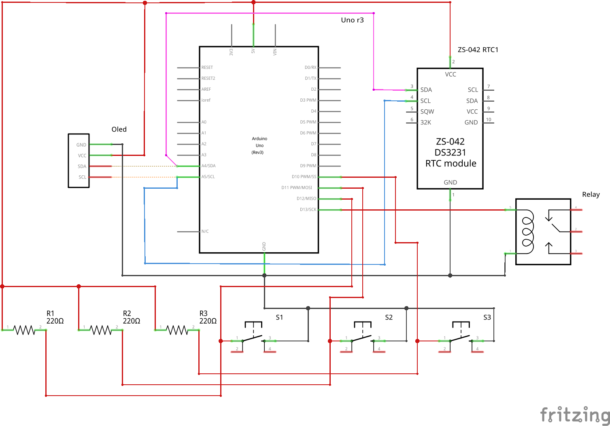
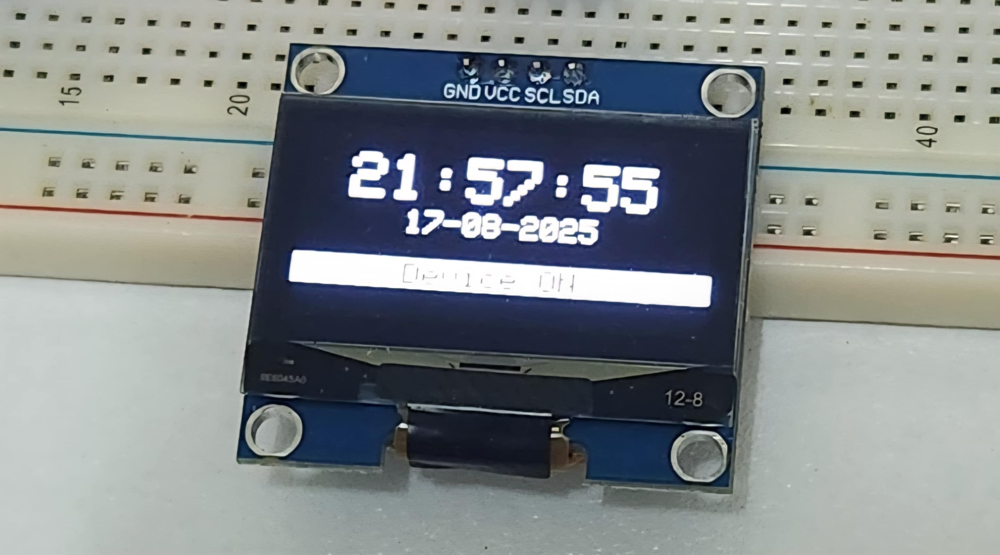

# DFAT - Device Functional Auto Timer

This project is an Arduino-based functional auto timer.

## Arduino RTC-Based Relay Timer with OLED Display

This project is an **Arduino-based relay controller** that uses a **DS3231 RTC module** to keep accurate time and an **OLED SH1106 display** to show real-time clock data, date, and device status.  

The system automatically turns a relay **ON/OFF** depending on the season and time schedule, while also allowing **manual time/date editing** using push buttons.  

---

## ✨ Features  

- ⏰ **Real-Time Clock (RTC)**  
- 📺 **OLED Display (SH1106)**  
- ⚡ **Relay Control** with seasonal schedules  
- 🎛 **Button Controls** for editing date & time  

---

## 🛠 Hardware Requirements  

- **Arduino Board** (Uno, Nano, Mega, etc.)  
- **DS3231 RTC Module**  
- **OLED Display (SH1106, I2C, 128x64)**  
- **Relay Module**  
- **Push Buttons (3x)** (Set, Increment, Decrement)  
- **Wires & Breadboard**  

---

## 🔌 Pin Connections  

| Component | Arduino Pin |
|-----------|-------------|
| OLED SDA  | A4 (SDA)    |
| OLED SCL  | A5 (SCL)    |
| Relay     | D13         |
| Set Btn   | D12         |
| Inc Btn   | D11         |
| Dec Btn   | D10         |
| RTC SDA   | A4 (SDA)    |
| RTC SCL   | A5 (SCL)    |

---

## 📦 Libraries Used  

- `Adafruit SH1106`  
- `Adafruit GFX`  
- `DS3231`  
- `Wire` (built-in)  
- `SPI` (built-in)  

---

## 📋 Circuit Diagram  

  

---

## ▶️ How It Works  

1. At startup, RTC initializes with Arduino compile time.  
2. Relay **ON/OFF** schedule depends on month:  
   - **Apr–Sep:** ON 18:25, OFF 05:45  
   - **Oct–Mar:** ON 17:30, OFF 05:50  
3. User can adjust **time & date** with buttons.  
4. OLED shows **time, date, and relay status**.  

---
## 🚀 Getting Started

1. Connect the circuit as shown in the diagram.  
2. Install required libraries from Arduino Library Manager.  
3. Upload the provided code to your Arduino.  
4. The OLED will show time, date, and relay status immediately.  

---

## 🎛 Button Functions

- **SET Button (D12):** Cycle through editable fields (Hour → Minute → Second → Day → Month → Year).  
- **INC Button (D11):** Increase the selected field.  
- **DEC Button (D10):** Decrease the selected field.  
- On exiting edit mode, the RTC is updated.  

---
## 🛠 Make / Build Instructions

To **make** this project, follow these steps:

1. **Hardware Setup**
   - Place Arduino, RTC, OLED, Relay, and buttons on a breadboard.  
   - Connect wires according to the **Pin Connections** table.  

2. **Software Setup**
   - Open Arduino IDE.  
   - Install required libraries via **Library Manager**.  
   - Load the provided `.ino` sketch.  

3. **Upload**
   - Connect Arduino via USB.  
   - Select correct **Board** and **Port** in Arduino IDE.  
   - Click **Upload**.  

4. **Test**
   - Power up your circuit.  
   - The OLED should show **time/date/device status**.  
   - Relay should follow the **seasonal auto-timer schedule**.  

---

## 📋 Example OLED Output

